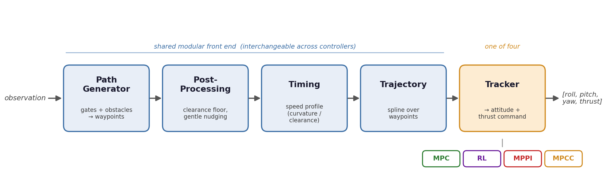

# Controllers

This folder contains all necessary code for the team XYZ for the Automomouse
Drone Racing Project Course in SoSe 26. 

Our four racing controllers and the shared planning pipeline they run on. All four solve the same problem, namely fly the drone through the gates as fast as it stays stable, but differ in the tracker that turns a reference trajectory into attitude/thrust commands.

Every controller's parameters are set to the values used for our **final real-flight runs** (the simulation laps time used in the report).

All code passed ruff pep8 checks.

## The pipeline

All four controllers share the same modular front end and differ only in the
tracker at the end:



The building blocks live in [`modules/`](modules/); each path generator exposes
`generate(obs, config)` and each trajectory exposes the same sampling interface,
so the front end is interchangeable across controllers.

### The pipeline we actually tuned (the `_astar` controllers)

`controller_mpc_astar` and `controller_rl_astar` are our main effort and share one
concrete, tuned stack:

| Stage | Module | Role |
| --- | --- | --- |
| Path generator | `AStarImprovedPathGenerator` (`path_generator_improved`) | A* on an inflated occupancy grid, with gate-frame threading, reversal/commit handling, and path pruning |
| Post-processing | `PathPostProcessor` (`post_processing`) | hard clearance floor + gentle pole nudging (Laplacian smoothing left off — it raised the crash rate) |
| Timing | `DynamicTiming` (`timing_module_improved`) | speed profile shaped by curvature, clearance, and reversals |
| Trajectory | `(Improved)SplineTrajectory` (`trajectory_module_improved`) | arc-length spline the tracker samples |
| Tracker | acados MPC (`mpc_astar`) / PPO policy (`rl_astar`) | the only differing stage |

The path generator, post-processing, and timing modules are identical across the
two; only the tracker changes. Their hyperparameters (the `*_HYPERPARAMS` dicts at
the top of each controller) were tuned with Optuna against the Level 3 randomized
track and reflect the operating points reported under [Results](#results). This is
the pipeline our conclusions are based on.

### MPPI and MPCC — learning prototypes, not tuned

`controller_mppi` and `controller_mpcc` were implemented by a teammate later in the
project. Because of time constraints they were **not fine-tuned** — the numbers below are from near-default settings.  They are included because building them taught us a lot (sampling-based control and contouring MPC respectively) and they still complete the track; treat them as working prototypes and a learning exercise rather than optimized results.

The RL controller also might not be optimum as our team have the combined GPU access of 
a single 4050 mobile that is heavily thermal throttled, hence also why we didnt persue
full rl based planner / controller or fine tune mppi even if they might give better result. 

## How to use a controller

### Step 1 — Select the controller in the race config

Set the `file` field under `[controller]` in the level config
(e.g. [`config/level3.toml`](../../../config/level3.toml) or `config/final.toml`).
Paths are relative to `lsy_drone_racing/control/`:

```toml
[controller]
# file = "controllers/controller_mpc_astar.py"    # acados MPC tracker
# file = "controllers/controller_rl_astar.py"     # PPO (learned) tracker
# file = "controllers/controller_mppi.py"         # sampling-based MPPI tracker
file   = "controllers/controller_mpcc.py"         # nonlinear contouring MPC tracker
```

### Step 2 — Select the pipeline modules inside the controller

Each controller wires its own front end. The table shows where to change it:

| Controller | Tracker | Where to pick planner / modules | Tuning knobs |
| --- | --- | --- | --- |
| `controller_mpc_astar.py` | acados linear MPC | fixed stack built in `__init__` (A* → post-proc → `DynamicTiming` → arc-length spline) | `MPC_HYPERPARAMS`, `PATHGEN_HYPERPARAMS`, `TIMING_HYPERPARAMS`, `POSTPROC_HYPERPARAMS` (module top) |
| `controller_rl_astar.py` | PPO policy (`utility/ckpt/ppo_track_final.ckpt`) | same A* stack as MPC, built in `__init__` | `PATHGEN_HYPERPARAMS`, `RL_TIMING_HYPERPARAMS`, `CHECKPOINT` (module top) |
| `controller_mppi.py` | sampling-based MPPI | `MPPIConfig.path_planner` selects the **whole** reference stack | `[controller.mppi]` in the config, or `MPPIConfig` defaults |
| `controller_mpcc.py` | nonlinear MPCC (acados) | `MPCCConfig.reference_planner` selects the search planner | `[controller.mpcc]` in the config, or `MPCCConfig` defaults |

## Results

Level 3 (fully randomized track) in simulation, and the fastest clean lap on the
**final real track**. Full logs and per-seed breakdowns are in
[`references/Final_Config_and_Results.md`](../../../references/Final_Config_and_Results.md).

| Controller | Sim success | Sim median lap | Real lap (single shot)|
| --- | --- | --- | --- |
| MPC   | 58 % (100 seeds) | 7.44 s | **7.42 s** (real final track) |
| RL    | 74 % (100 seeds) | 8.50 s | **8.82 s** (real final track) |
| MPPI  | 65 % (13/20 seeds) | ~10.68 s | **8.84 s** (demoday final-like)|
| MPCC  | 90 % (18/20 seeds) | 13.60 s | **12.03 s** (demoday final-like)|

The MPC row is the aggressive tuning we actually flew; the same pipeline retunes across a speed/reliability spectrum — from 58 % @ 7.4 s (aggressive) to 86 % @ 10.6 s (conservative) — which is the point of keeping planning modular. Success and lap time trade off against each other, and the fastest tracker in the sim is not the most reliable one.

## Running

1. Follow the [official setup guide](https://lsy-drone-racing.readthedocs.io/en/latest/getting_started/setup.html)
   to install `pixi` and the base environment.
2. Install `numba`, needed by the A* path planners but not pulled in by the base install:
   ```bash
   pixi run pip install numba
   pixi add numba
   ```
   This is due to the currently rapid changing main fork that could cause things to break.
   Can be added into pyproject.toml or pixi.lock if later stable. 
3. For the RL controller (`controller_rl_astar.py`) or `train_rl_track.py`, use the `tests`
   environment — it bundles the `rl` feature (`torch`) that the base/`default` environment
   lacks:
   ```bash
   pixi run -e tests python scripts/sim.py --config level3.toml --controller controllers/controller_rl_astar.py
   ```
4. Select a controller in the toml in /config and run it
    ```bash
    # Single visual run on a level
    python scripts/sim.py --config level3.toml

    # Batch evaluation over 100 random level 3 seeds 
    python lsy_drone_racing/control/controllers/utility/sim/evaluate_seeds_gui.py --config level3.toml --n_seeds 100 --rng_seed 1 --render False

    # Batch evaluation over 100 final track with randomized dynamics / obstacle locations

    python lsy_drone_racing/control/controllers/utility/sim/evaluate_seeds_gui.py --config final.toml --n_seeds 100 --rng_seed 1 --render False

    ```

## Directory layout

```
controllers/
├── controller_mpc_astar.py     # MPC tracker (Optuna-tuned)
├── controller_rl_astar.py      # RL (PPO) tracker
├── controller_mppi.py          # MPPI tracker
├── controller_mpcc.py          # MPCC tracker
├── modules/                    # shared pipeline: path generators, post-processing,
│                               #   timing, trajectory, occupancy grid, search planners
├── utility/
│   ├── sim/                    # evaluate_seeds, inspect_sim, analyze_flight (dev tools)
│   ├── train/                  # train_rl_track.py — PPO tracker training + reference bank
│   ├── optimize/               # tune_mpc.py — Optuna hyperparameter search
│   └── ckpt/                   # trained policies (ppo_track_final.ckpt is the deployed one)
└── challenge/                  # original acceptance-challenge controllers, run standalone
```

Everything we trained lives in `utility/ckpt/`.

## AI usage disclaimer

All core implementation ideas, control methods, system design choices, the modular planning pipeline, and the experimental methodology were developed by the authors. With the exception of parts of the MPPI and MPCC controllers, AI assistants were used only as supporting tools for auxiliary tasks, including code refactoring, docstrings, documentation, formatting, simple utility implementations, and validation scripts. All design and algorithmic decisions, as well as their evaluation and validation, were made by the authors.
